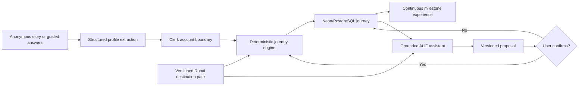

# ALIF

> Your personal journey from planning the move to feeling at home.

ALIF turns the uncertainty of relocating into one connected, personalized life
journey. A person can describe their situation naturally or answer five focused
questions. After sign-up, ALIF creates an ordered path across residency,
identity, housing, utilities, money, mobility, and family life.

Dubai is the first versioned destination pack. The product architecture is
destination-neutral so future city packs can reuse the profile, journey engine,
assistant, and interface.


## Why ALIF

Relocation guidance is usually fragmented across government portals, agents,
forums, saved messages, and generic checklists. Those resources rarely explain
dependencies: which decision must come first, what a completed step unlocks, or
which steps do not apply to a specific household.

ALIF models settling as a journey:

- hybrid onboarding in the user's own words or through guided questions;
- no personalized journey is revealed before account creation;
- deterministic selection and ordering from a curated Dubai pack;
- official links for government actions and visible source-verification dates;
- milestone progress that unlocks dependent chapters;
- a grounded assistant that explains the selected journey;
- explicit confirmation before any assistant-proposed change;
- user-controlled profile visibility and deletion.

## Architecture



The AI layer does not own procedures, dependencies, or URLs. It normalizes a
story into a strict schema and explains only the definitions selected from the
destination pack. The journey engine remains deterministic and testable.

## Stack

- Next.js 16, React 19, TypeScript, Tailwind CSS
- Clerk with Google and email/password authentication
- OpenAI Responses API with structured Zod outputs
- Neon PostgreSQL and Drizzle ORM
- Vitest, Testing Library, Playwright, GitHub Actions
- Vercel-ready application and migration workflow

## Local setup

Requirements: Node.js 22+, npm, a Clerk development instance, an OpenAI API key,
and a Neon PostgreSQL database.

1. Copy `.env.example` to `.env.local`.
2. Add Clerk, OpenAI, Neon, and rate-limit values.
3. Run `npm install`.
4. Run `npm run db:migrate`.
5. Run `npm run dev`.

In Clerk, enable Google and email address + password. Configure `/sign-up` and
`/sign-in` using the redirect values in `.env.example`.

## Environment variables

| Variable | Scope | Purpose |
| --- | --- | --- |
| `NEXT_PUBLIC_CLERK_PUBLISHABLE_KEY` | Browser | Clerk frontend configuration |
| `CLERK_SECRET_KEY` | Server | Clerk authentication verification |
| `NEXT_PUBLIC_CLERK_SIGN_UP_URL` | Browser | Branded sign-up route |
| `NEXT_PUBLIC_CLERK_SIGN_IN_URL` | Browser | Branded sign-in route |
| `NEXT_PUBLIC_CLERK_SIGN_UP_FALLBACK_REDIRECT_URL` | Browser | Post-sign-up generation route |
| `NEXT_PUBLIC_CLERK_SIGN_IN_FALLBACK_REDIRECT_URL` | Browser | Returning-user journey route |
| `OPENAI_API_KEY` | Server | Structured profile and assistant requests |
| `OPENAI_MODEL` | Server | Versioned model choice; defaults to `gpt-5.6-terra` |
| `DATABASE_URL` | Server | Neon PostgreSQL connection |
| `RATE_LIMIT_SALT` | Server | 32+ character HMAC salt for rate-limit identifiers |

Never commit environment files or real credentials.

## Required checks

```bash
npm run lint
npm run typecheck
npm run test:unit
npm run build
npm run test:e2e -- --project public-chromium
```

Authenticated browser tests additionally require Clerk test credentials,
`E2E_CLERK_USER_EMAIL`, a migrated Neon database, and an OpenAI key. They do not
use an authentication bypass.

## Database

Generate a migration after a schema change:

```bash
npm run db:generate
```

Apply committed migrations:

```bash
npm run db:migrate
```

All journey, step, profile, and proposal queries are scoped to the authenticated
Clerk owner. Deleting the local user row cascades through all ALIF-owned data.

## Destination-pack maintenance

Dubai definitions live in
`src/data/destinations/dubai/pack.ts`. Each stable definition has:

- applicability rules and prerequisite IDs;
- a phase, milestone, and category;
- explanatory copy and a suggested service type when relevant;
- an official authority URL for government actions;
- a `lastVerifiedAt` date.

When an official process changes, update the definition, refresh its
verification date, increment the pack version, and run the pack and journey
engine tests. Never place unverified procedural facts in an AI prompt.

## Trust boundary

AI normalizes profiles and explains selected content. The versioned Dubai pack
owns official URLs, facts, applicability, and dependencies. ALIF is guidance,
not legal, immigration, financial, medical, or real-estate advice.

Anonymous onboarding data remains in `sessionStorage` and is cleared after
journey creation. Assistant changes are persisted as expiring proposals and
applied only through a fresh owner-scoped confirmation transaction.

## Vercel preview deployment

1. Import the GitHub repository into Vercel.
2. set the framework preset to Next.js.
3. Add every variable from `.env.example` to the Preview environment.
4. Create or select a preview Neon branch and set its `DATABASE_URL`.
5. Run `npm run db:migrate` once against that preview database.
6. Deploy the feature branch and run the public and authenticated acceptance
   checks.

Do not promote a preview to production until CI, authentication, migrations,
desktop/mobile verification, and the complete demo flow pass.

### Rollback

Use the Vercel project deployment history to redeploy the previously verified
deployment. Database migrations in this MVP are additive; if a future migration
is destructive, ship a separately reviewed backward migration before rolling
application code back.

## Project documents

- [Product and UX specification](docs/superpowers/specs/2026-07-20-alif-mvp-design.md)
- [Implementation plan](docs/superpowers/plans/2026-07-20-alif-mvp.md)
- [Devpost submission copy](docs/devpost/submission.md)
- [Brand mark](docs/brand/alif-mark.svg)
- [Logo lockup](docs/brand/alif-lockup.svg)
