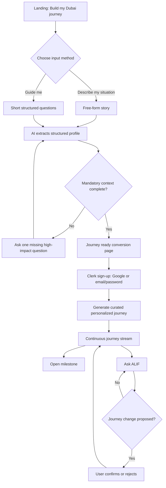
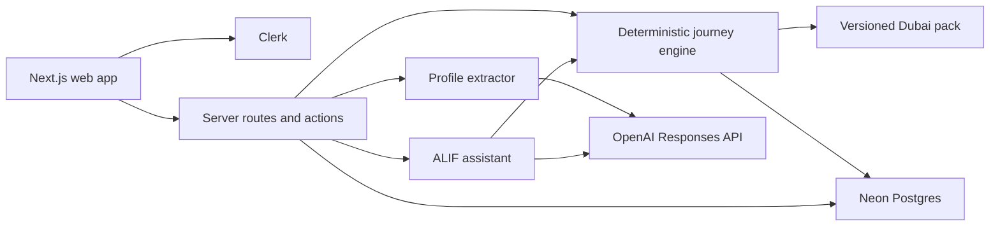

# ALIF MVP Product and Experience Design

**Date:** 2026-07-20  
**Status:** Approved
**Destination pack:** Dubai  
**Product surface:** Standalone responsive web application

## 1. Product definition

### Elevator pitch

**ALIF — Your personal journey from planning the move to feeling at home.**

### Problem

People considering or completing a move to Dubai must coordinate immigration,
identity, housing, utilities, banking, transport, family, and daily-life
decisions. Information exists, but it is fragmented, changes over time, and
rarely explains sequence or dependencies. Generic checklists tell users what
exists; they do not tell a specific person what matters now, what becomes
possible next, or why.

### Product promise

ALIF turns a relocation story into a dependency-aware settling journey. It
combines a curated destination pack with AI understanding so users receive a
clear, personal route rather than an invented list of administrative facts.

### Hero user

The MVP serves anyone considering Dubai, preparing to move, or already there.
The journey adapts to:

- Household: single or married, with or without children
- Whether household members move together or at different times
- Relocation stage: exploring, preparing, or already arrived
- Approximate move date
- Residency path: employment, business or self-sponsored, family-sponsored,
  or unknown
- Passport country
- Optional household income range for affordability guidance

### MVP success moment

Within 90 seconds, a judge can describe a relocation situation, answer only
essential missing questions, create an account, and see a polished journey
whose next milestone and dependencies are visibly different because of the
provided context. The judge can then ask ALIF a question and approve a proposed
journey update.

## 2. Scope

### Included

- Dubai landing page and product story
- Hybrid onboarding: free-form description or guided questionnaire
- AI extraction of a structured relocation profile
- Follow-up questions only for missing mandatory facts
- Optional household-income range
- Pre-result authentication gate
- Clerk Google sign-in and email/password sign-up
- Curated Dubai destination pack with approximately 15 applicable guided steps
- Dependency-aware journey generation
- Continuous milestone-based journey interface
- Milestone detail with official links, requirements, dependencies, and notes
- Journey progress and guided-step completion
- ALIF assistant using profile and journey context
- Assistant-proposed journey changes requiring explicit user confirmation
- Responsive desktop and mobile experiences
- Vercel deployment

### Explicitly excluded from the two-day MVP

- Multiple destination packs
- Document uploads, OCR, or document vault
- Live government-system integrations
- Live property, school, restaurant, or vehicle listings
- Payments or paid partner placement
- Claimed commercial partnerships
- Agent, broker, or PRO booking
- Calendar reminders and push notifications
- Exact legal eligibility determinations
- Native mobile applications
- Admin content-management UI
- Full budgeting tool

## 3. Approaches considered

### Approach A: AI generates the whole journey

This is the fastest path to broad-looking output, but it can invent procedures,
links, or dependencies. It is unsuitable for high-trust relocation guidance.

### Approach B: Fixed rules and templates

This provides predictable facts and ordering but makes the AI feel ornamental.
It also handles nuanced relocation stories poorly.

### Approach C: Curated journey graph plus AI understanding — selected

The Dubai pack owns factual content, applicability rules, dependencies, and
official sources. AI extracts the profile, identifies missing context, explains
the journey, and proposes changes. A deterministic journey engine selects and
orders the curated steps.

This approach provides the strongest balance of trust, personalization,
demonstrability, cost, and implementation risk.

## 4. Brand system

### Brand meaning

Alif is the first letter of the Arabic alphabet and represents a beginning.
The brand uses that meaning as a product principle: ALIF begins with the
person's current reality and helps them move forward one meaningful chapter at
a time.

### Brand personality

- Calm, never bureaucratic
- Knowledgeable, never overconfident
- Warm, never childish
- Premium, never luxurious for its own sake
- Global, with a respectful Dubai origin
- Action-oriented, without becoming a task manager

### Voice

ALIF speaks in short, plain sentences. It explains why a step matters and what
it unlocks. It distinguishes official requirements from recommendations and
avoids guarantees.

Preferred:

> Your residency path affects the documents, banking, and housing chapters
> ahead. Let’s choose the route that best matches your situation.

Avoid:

> Complete Task 1 to unlock Tasks 2, 3, and 4.

### Logo

The mark begins as a small route point, curves upward, and resolves into an open
upright doorway. It represents movement, arrival, and a first beginning without
using travel clichés.

Assets:

- [`docs/brand/alif-mark.svg`](../../brand/alif-mark.svg)
- [`docs/brand/alif-lockup.svg`](../../brand/alif-lockup.svg)
- [`docs/brand/alif-logo-concept.png`](../../brand/alif-logo-concept.png)

Usage rules:

- Use the full lockup on landing and authentication screens.
- Use the mark alone in the application navigation and favicon.
- Minimum mark size: 24 px digital.
- Minimum lockup width: 120 px digital.
- Keep clear space equal to at least half the mark height.
- Do not rotate, outline, recolor individual paths, add gradients, or place the
  mark on visually noisy backgrounds.

### Color tokens

| Token | Value | Use |
|---|---:|---|
| `brand.oasis` | `#133C33` | Primary navigation, strong surfaces, trust |
| `brand.journey` | `#F2662E` | Active path, current milestone, emphasis |
| `brand.journeyText` | `#B84212` | Accessible orange text on light surfaces |
| `surface.sand` | `#F7F4EE` | Page background |
| `surface.white` | `#FFFFFF` | Cards and raised surfaces |
| `text.ink` | `#18201E` | Primary text |
| `text.muted` | `#69736F` | Secondary text |
| `border.subtle` | `#DFE4E1` | Dividers and card outlines |
| `category.identity` | `#6553D8` | Immigration and identity |
| `category.home` | `#2D7BD9` | Home and utilities |
| `state.success` | `#267A4A` | Completed milestones and confirmation |
| `state.warning` | `#9A5B00` | Attention without alarm |
| `state.error` | `#B42318` | Failures and destructive warnings |

Verified text combinations meet WCAG AA for normal text:

- Oasis on white: 12.20:1
- Ink on sand: 15.13:1
- Journey text on white: 5.49:1
- Muted text on white: 4.90:1
- White on identity purple: 5.55:1
- White on success green: 5.30:1

The bright journey orange is decorative or paired with dark ink; it is not used
as small text on white.

### Typography

- Display and headings: **Manrope**, weights 600–800
- Body and controls: **Inter**, weights 400–700
- Fallback: `ui-sans-serif, system-ui, sans-serif`
- Base body size: 16 px desktop and mobile
- Minimum supporting text: 13 px
- Line length: 60–72 characters for explanatory content

Type scale:

| Role | Desktop | Mobile | Weight |
|---|---:|---:|---:|
| Display | 56/60 | 40/44 | 750 |
| H1 | 40/46 | 32/38 | 750 |
| H2 | 30/36 | 26/32 | 700 |
| H3 | 22/28 | 20/26 | 700 |
| Body | 16/25 | 16/24 | 400 |
| Small | 14/20 | 14/20 | 500 |
| Label | 12/16 | 12/16 | 700 |

### Shape, spacing, and motion

- Spacing uses a 4 px base: 4, 8, 12, 16, 24, 32, 48, 64
- Card radius: 20 px
- Button and field radius: 12 px
- Pills: fully rounded
- Shadows are subtle and neutral; borders carry most hierarchy
- Journey motion lasts 180–240 ms and uses ease-out
- Completing a guided step advances the path with a restrained line-fill
  animation
- Reduced-motion preferences remove path drawing and panel transitions

### Iconography

Use simple rounded line icons at 1.75 px stroke. Category colors support
recognition, but every state also has a text label. Avoid national symbols,
airplanes, globes, suitcases, and map-pin clichés.

## 5. Information architecture

### Public routes

- `/` — landing page
- `/start` — choose free-form or guided onboarding
- `/start/story` — free-form relocation description
- `/start/guided` — mandatory and optional questions
- `/start/questions` — AI-generated missing-context questions
- `/journey-ready` — conversion page with no journey details
- `/sign-up` — Clerk sign-up
- `/sign-in` — Clerk sign-in

### Authenticated routes

- `/journey/generating` — short generation state
- `/journey` — continuous journey stream
- `/journey/milestones/[id]` — milestone detail
- `/profile` — relocation profile and optional preferences

The MVP navigation contains only **Journey** and **Profile**. Ask ALIF is a
persistent floating action that opens a drawer. Documents, budget, partners,
and saved places are not presented as empty navigation promises.

## 6. Primary user flow

### Mandatory onboarding fields

1. Relocation stage
2. Approximate move date or timeframe
3. Household structure and who moves together
4. Residency path or `unknown`
5. Passport country

Income is optional, collected as a monthly household range, and accompanied by
a clear explanation: it improves housing and budget guidance. If skipped, ALIF
does not produce specific affordability claims.

### Pre-auth conversion rule

Anonymous users receive no journey steps, official recommendations, or partial
plan. Once required context is complete, ALIF says:

> Your Dubai journey is ready to be created.
>
> Create your free account to see your milestones, understand what comes next,
> and keep your journey as your plans change.

The system does not claim the full journey already exists before it is
generated. The structured onboarding draft stays in browser session storage and
is validated again after authentication.

## 7. Screen design

### 7.1 Landing page

Goal: communicate sequence and personalization, not a directory of Dubai tips.

Above the fold:

- ALIF lockup
- Headline: **Your move is more than a checklist.**
- Supporting copy: **Tell ALIF where you are starting. Get a personal journey
  from considering Dubai to feeling at home.**
- Primary CTA: **Build my Dubai journey**
- Secondary action: **See how it works**
- A journey preview with one emphasized milestone and a visible path

Below the fold:

1. Describe your situation
2. Get a journey built around your life
3. Move forward with the right next chapter

Trust copy states that government actions link to official sources and that
ALIF is guidance, not legal advice.

### 7.2 Onboarding choice

Two equal cards:

- **Tell ALIF my story** — one natural-language prompt
- **Guide me step by step** — a short questionnaire

Both routes show an expectation of approximately two minutes. Users can switch
methods without losing answers.

### 7.3 Free-form story

The prompt asks:

> Tell us what is bringing you to Dubai, when you may move, and who is moving
> with you. Share only what you are comfortable sharing.

Example prompt chips demonstrate useful context without prescribing an answer.
After submission, ALIF asks only one missing mandatory question at a time.

### 7.4 Guided onboarding

Questions are presented in one focused card with progress such as `2 of 5`.
Household choices reveal only relevant child and relocation-timing controls.
The optional income range is last and clearly skippable.

### 7.5 Journey-ready conversion page

This page provides confidence without leaking the result:

- Confirmation that enough context exists
- Three generic benefits: ordered milestones, official links, adaptive guidance
- Clerk sign-up options
- Privacy note

It does not display milestone titles, counts tailored to the user, or specific
recommendations before registration.

### 7.6 Generating state

The path animates through three truthful system states:

1. Understanding your starting point
2. Matching the Dubai destination pack
3. Ordering your first chapters

If generation exceeds eight seconds, supporting copy explains that ALIF is
checking dependencies. The UI never shows fake percentages.

### 7.7 Journey stream

The journey is a continuous vertical path inspired by a day itinerary, not a
task dashboard.

Structure:

- Header: `From exploring to feeling at home`
- Overall progress stated quietly
- Left rail: journey timing or phase
- Circular category marker connected by the path
- Large milestone card aligned to each marker
- Current milestone outlined in journey orange
- Future milestones use neutral borders
- Completed milestones use success green
- One primary action: **Begin chapter** or **Continue chapter**
- Ask ALIF floating action opens a right drawer on desktop and bottom sheet on
  mobile

Milestone language describes life progress:

- **Define your route to Dubai**
- **Make the move financially real**
- **Prepare what your new life requires**
- **Land with confidence**
- **Become a Dubai resident**
- **Open the door to your first home**
- **Turn your address into a functioning home**
- **Set up money and mobility**
- **Feel at home—not just moved in**

Guided administrative steps exist inside milestones. They never dominate the
main journey view.

### 7.8 Milestone detail

The detail page contains:

- Why this chapter matters
- What it unlocks
- Two to four guided steps
- Prerequisites and blockers
- Personalized notes
- Official-source links with source name and verification date
- Completion controls
- **Ask ALIF about this chapter**

Completing a guided step recalculates milestone and downstream states. Users can
undo a completion from the same session.

### 7.9 Ask ALIF

The assistant begins with suggested questions relevant to the active milestone.
It may:

- Explain a requirement in simpler terms
- Compare options already represented in the Dubai pack
- Identify which profile fact caused a recommendation
- Propose changing a profile preference
- Propose adding, removing, or reordering an applicable guided step

It may not silently change profile or journey state. Every mutation appears in
a confirmation card showing the proposed change and its downstream effect.

## 8. Dubai destination pack

The pack is versioned application data. Every guided-step definition contains:

- Stable ID and pack version
- Category and journey phase
- Display title and life-oriented parent milestone
- Applicability conditions
- Prerequisite step IDs
- Completion criteria
- Official-source URL and source organization where applicable
- `lastVerifiedAt` date
- Neutral explanatory copy
- Optional private-service type without a claimed provider relationship

The MVP pack contains approximately 18 definitions from which a typical journey
selects around 15:

- Residency route
- Relocation budget
- Neighborhood shortlist
- Document preparation or attestation
- Entry or residency initiation
- Medical fitness and biometrics where applicable
- Emirates ID
- Health insurance
- Housing search
- Tenancy review
- Ejari
- DEWA
- District cooling where property-dependent
- Mobile service
- Home internet
- Bank account and UAE Pass
- Driving licence, public transport, or vehicle path
- Family sponsorship or school preparation where applicable

Government actions link only to official sources. Private-service suggestions
are labeled **Suggested service type**, not **Partner**, until a commercial
relationship exists.

## 9. System architecture

### Selected stack

- Next.js App Router
- TypeScript
- Tailwind CSS and accessible headless components
- Clerk authentication with Google and email/password
- Neon Postgres
- Drizzle ORM and migrations
- OpenAI Responses API
- `gpt-5.6-terra` as the default low-latency model
- Vercel hosting

The model name is supplied by `OPENAI_MODEL` so evaluation can promote a request
to `gpt-5.6` without code changes.

### Component boundaries

#### Profile extractor

Accepts either free-form text or structured answers and returns a schema-valid
profile plus a list of missing mandatory fields. It never produces journey
guidance.

#### Dubai pack repository

Loads and validates versioned step definitions. It is the source of truth for
official copy, dependencies, applicability, and URLs.

#### Journey engine

Filters pack definitions by profile, resolves the dependency graph, groups
steps into life milestones, and computes `completed`, `current`, `available`,
and `blocked` states. It is deterministic and unit-testable without OpenAI.

#### Journey personalizer

Uses AI to produce brief personal context for selected milestones. Its output
cannot add procedures, URLs, prerequisites, or unsupported claims.

#### Assistant orchestrator

Answers from the profile, journey snapshot, and selected pack content. Mutating
tools return proposals; a separate authenticated confirmation endpoint applies
validated changes.

#### Persistence layer

Stores Clerk user ID, profile, journey snapshot, pack version, progress, and
confirmed changes. Anonymous onboarding is not stored in the database.

## 10. Data model

### `users`

- `id`
- `clerk_user_id` unique
- `created_at`
- `updated_at`

### `relocation_profiles`

- `id`
- `user_id` unique
- `destination_code` fixed to `AE-DXB` in MVP
- `stage`
- `move_timeframe`
- `household_json`
- `residency_path`
- `passport_country`
- `income_range` nullable
- `preferences_json`
- `created_at`
- `updated_at`

### `journeys`

- `id`
- `user_id`
- `destination_pack_version`
- `status`
- `generated_at`
- `updated_at`

### `journey_steps`

- `id`
- `journey_id`
- `definition_id`
- `milestone_key`
- `position`
- `state`
- `completed_at` nullable
- `personal_note` nullable

Chat history is session-only in the MVP. Confirmed profile and journey changes
are persisted directly; raw anonymous stories and full chat transcripts are not
stored.

## 11. Server operations

- `POST /api/onboarding/extract`
  - Anonymous, rate-limited
  - Returns normalized profile draft and one missing mandatory question
- `POST /api/journeys`
  - Authenticated
  - Validates draft, creates profile, runs journey engine, persists snapshot
- `PATCH /api/journey-steps/:id`
  - Authenticated and owner-scoped
  - Marks complete or reopens; recomputes downstream state
- `POST /api/assistant`
  - Authenticated and rate-limited
  - Streams explanation or a structured change proposal
- `POST /api/assistant/proposals/:id/confirm`
  - Authenticated and owner-scoped
  - Revalidates and applies an unexpired proposal

All inputs and model outputs are schema-validated. Client-supplied Clerk IDs,
journey ownership, step applicability, and dependency changes are never trusted.

## 12. Safety, privacy, and trust

- Collect only information required for personalization.
- Request income as an optional range, never exact salary.
- Do not collect passport numbers, Emirates ID numbers, credentials, or document
  scans.
- Keep OpenAI calls server-side.
- Send only relevant profile fields to the model.
- Use rate limits for anonymous extraction and authenticated assistant calls.
- Treat free-form onboarding and chat content as untrusted input.
- Instruct the assistant to ignore requests to reveal prompts, secrets, other
  users, or unsupported internal data.
- Escape model-rendered text; do not render arbitrary HTML.
- Validate all model-produced IDs against the current user's journey and pack.
- Label government links as official and recommendations as guidance.
- Show source organization and verification date.
- State that ALIF is not legal, immigration, financial, or real-estate advice.
- Provide a direct profile-deletion path in the authenticated UI.

## 13. Error handling

| Failure | User experience | System behavior |
|---|---|---|
| Profile extraction timeout | Preserve input and offer retry | One bounded retry; structured manual fallback |
| Missing or invalid model JSON | Ask the relevant guided question | Reject output and fall back to schema-driven UI |
| Journey personalization failure | Show the valid curated journey | Persist engine result without personal notes |
| Journey creation failure | Keep onboarding draft and show retry | Idempotency key prevents duplicates |
| Clerk cancellation | Return to journey-ready page | Preserve session draft |
| Assistant timeout | Keep current journey unchanged | Retry option; no partial mutation |
| Expired proposal | Explain that the journey changed | Regenerate proposal against current version |
| Official link missing | Hide action and flag content error | Pack validation fails CI for required sources |
| Database unavailable | Clear non-destructive error | No optimistic completion is committed |

## 14. Accessibility and responsive behavior

- WCAG 2.2 AA contrast target
- Full keyboard access for onboarding, journey, details, and assistant
- Visible focus indicators
- Semantic headings and ordered journey structure
- Journey state never communicated by color alone
- Minimum 44-by-44 px touch targets
- Form labels remain visible after entry
- Errors appear next to the field and in an accessible summary
- Mobile journey retains the rail and milestone rhythm with a 44 px rail
- Assistant becomes a bottom sheet on narrow screens
- Reduced-motion support
- Screen-reader announcement when completion unlocks a new milestone

## 15. Testing strategy

### Unit tests

- Applicability rules for stage, household, residency path, and optional income
- Dependency ordering and cycle detection
- Current and blocked state calculation
- Pack schema and official-source validation
- Profile extraction schema handling
- Assistant proposal authorization and expiry

### Integration tests

- Anonymous story to missing-question loop
- Guided onboarding to journey-ready gate
- Clerk webhook creates or reconciles a user
- Authenticated journey generation is idempotent
- Step completion unlocks the correct downstream milestone
- Failed AI personalization still returns a valid curated journey
- Proposal confirmation applies only to the owning user's current journey

### End-to-end tests

1. Exploring, single professional, employment route, income skipped
2. Preparing, married with children, family moves together, income supplied
3. Already arrived, residency route unknown, guided onboarding
4. Free-form input missing passport country and timeframe
5. Google sign-up and email/password sign-up
6. Ask ALIF, receive a journey-change proposal, reject it
7. Ask ALIF, receive a valid proposal, confirm it, and observe the updated path
8. Mobile viewport and keyboard-only completion flow

### Demo acceptance criteria

- Fresh visitor reaches the conversion gate without authentication.
- No personalized journey detail leaks before sign-up.
- A signed-in user receives a journey selected from the Dubai pack.
- The current milestone and at least one dependency are visually obvious.
- Completing a guided step updates the journey.
- Every government action shown in the demo has an official source.
- Assistant mutations require confirmation.
- The happy path works on desktop and mobile.
- Production deployment contains no secret in client bundles or repository
  history.

## 16. Two-day implementation priorities

### Must work

1. Landing and hybrid onboarding
2. Mandatory-context extraction loop
3. Clerk authentication gate
4. Curated Dubai pack and deterministic journey engine
5. Continuous journey stream
6. One complete milestone detail path
7. Assistant explanation and one confirmed update type
8. Responsive styling, error states, tests, and deployment

### Cut in this order if time becomes constrained

1. Multiple assistant update types
2. Fine-grained milestone animations
3. Profile editing beyond mandatory fields
4. More than one private-service suggestion type
5. Journey history

Authentication, official-source integrity, the real journey experience, and the
confirmation boundary are not cut candidates.

## 17. Final product decisions

- ALIF is global by brand and architecture; Dubai is the first destination pack.
- The product is a standalone web application.
- The journey stream, not a task dashboard or category grid, is the primary UI.
- Milestones represent life progress; guided steps hold administrative detail.
- Users can describe their situation or use a guided questionnaire.
- ALIF asks only for missing mandatory information.
- Income is optional and range-based.
- The journey remains hidden until real Clerk sign-up.
- Google and email/password are the supported sign-up methods.
- AI proposes journey changes; users confirm them.
- Official content comes from a curated, versioned pack.
- Private providers are not labeled partners without a real agreement.
- The default OpenAI model is `gpt-5.6-terra`, configurable by environment.
- The MVP prioritizes trust and one polished end-to-end story over breadth.
